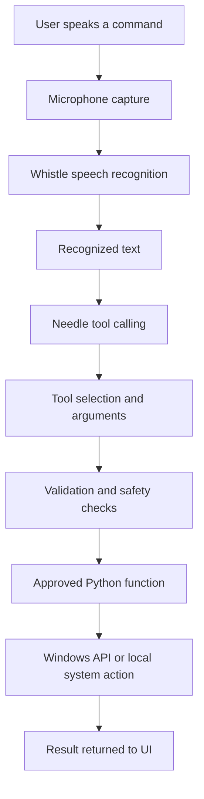

# LocalPilot 🧭

### Your voice. Your computer. Your commands.

**A local-first, voice-controlled desktop assistant for Windows, built with Python and Cactus AI models.**

LocalPilot lets you interact with your computer using natural language. Instead of navigating through menus or remembering keyboard shortcuts, you can speak a command and let a lightweight AI model interpret your intent and invoke the appropriate tool.

Built for the **Hacktoberfest Weekend Dev Challenge**.

---

## 💡 The Story Behind LocalPilot

A friend of mine often found himself switching between applications, browser tabs, and system settings while working on his laptop. Even simple tasks meant interrupting what he was doing to navigate menus or search for the right application.

That got me thinking: *what if you could just tell your computer what you want, and it handled the rest?*

That idea became LocalPilot — a step toward making everyday desktop interactions more natural, accessible, and efficient.

---

## 🚀 What is LocalPilot?

LocalPilot is a Python-based Windows desktop assistant that combines speech recognition, lightweight AI-powered tool calling, and native operating-system actions.

It follows a simple principle:

**You describe the task. The model interprets it. LocalPilot executes an approved action.**

For example, you could say:

- "Open Calculator."
- "Open leetcode.com in my browser."
- "Set a timer for one minute."
- "Which applications are running?"
- "Is Chrome open?"
- "Close Notepad."

LocalPilot converts your voice into text, determines which available tool best matches your intent, validates the arguments, and executes the corresponding Python function.

Unlike a general-purpose chatbot, LocalPilot is designed to perform practical actions on your computer.

## ✨ Features

### 🎙️ Voice-first interaction
- Capture microphone input and transcribe speech using Whistle.
- Process recognized commands without requiring users to type every request.
- Present recognized speech and action results through a desktop interface.

### 🧠 AI-powered tool calling
- Use Needle to map natural-language requests to predefined tools.
- Extract structured arguments from conversational instructions.
- Keep intent interpretation separate from the actual operating-system actions.

### 🖥️ Windows application control
- Launch supported desktop applications and Windows utilities.
- Open Windows Settings and selected settings pages.
- Request graceful closure of supported applications.
- Check which applications are currently running.

### 🌐 Website navigation
- Open requested websites in the system's default browser.
- Accept natural domain names such as `leetcode.com` and URLs beginning with `https://`.
- Validate URLs before attempting to open them.

### ⏱️ Timer and utility actions
- Set timers using natural-language durations.
- Notify the user when a timer completes.
- Provide basic system information, such as the current date and time.

### 🔒 Safety-conscious execution
- Expose a defined set of Python tools rather than unrestricted shell access.
- Validate application names, URLs, and tool arguments.
- Keep potentially destructive operations separate from ordinary actions.
- Prefer graceful application closure over forceful termination.

> Feature availability may vary by the current implementation and Windows environment. See the project status and testing notes before relying on a particular action.

---

## 🏗️ Architecture

LocalPilot separates speech recognition, intent interpretation, action execution, and the graphical interface into distinct responsibilities.



### 1. Audio input and transcription — Whistle

The microphone captures the user's voice. Whistle converts the audio into a text transcript that can be processed by the rest of the application.

This component is responsible for recognizing what the user said, not deciding which Windows operation to execute.

### 2. Intent interpretation — Needle

The transcript is passed to Needle together with the tools exposed by LocalPilot.

Needle identifies the appropriate function and extracts its arguments. For example, the request "Set a timer for one minute" could be represented as a call to a timer function with a duration of `60` seconds.

This avoids having to write a separate keyword-matching rule for every possible phrasing.

### 3. Validation and tool execution — Python

LocalPilot implements the actual actions as Python functions.

Examples include:

- Launching an approved application.
- Opening a validated HTTP or HTTPS URL.
- Reading the list of running applications.
- Starting a timer.
- Requesting that a supported application close.

The model selects from available tools; it does not need unrestricted access to execute arbitrary commands.

### 4. Desktop interface — PySide6

The graphical interface provides a place to interact with the assistant and view its state, recognized speech, progress, results, and errors.

Background tasks should be handled without blocking the GUI thread, so the interface remains responsive during transcription and tool execution.

### Design principle

Each component has a focused responsibility:

| Component | Responsibility |
|---|---|
| Microphone capture | Receive audio |
| Whistle | Convert audio into text |
| Needle | Select tools and extract arguments |
| Python action layer | Validate and execute operations |
| PySide6 | Present the interaction and results |

This separation makes it easier to add new tools without rewriting the audio pipeline or the entire interface.

---

## 🧩 The Cactus ecosystem

LocalPilot builds on tools developed by [Cactus Compute](https://www.cactuscompute.com/), particularly Needle and Whistle.

### 🌵 Cactus

Cactus provides an ecosystem for running AI models on local and resource-constrained devices. Its work focuses on making model inference practical across environments where compute, memory, and power may be limited.

For LocalPilot, this matters because a desktop assistant should not necessarily require a large cloud-hosted language model for every short command.

**Relevant resources:**
- [Cactus Compute](https://www.cactuscompute.com/)
- [Cactus documentation](https://docs.cactuscompute.com/)
- [Cactus GitHub organization](https://github.com/cactus-compute)

### 🪶 Whistle — Speech recognition

[Whistle](https://www.cactuscompute.com/blog/whistle) is Cactus's lightweight speech-to-text model.

It converts recorded speech into text that downstream components can understand. LocalPilot uses this transcription as the input to its command-processing pipeline.

Whistle is designed to run on CPU-based hardware, making it suitable for experiments with lightweight assistants and resource-constrained devices.

According to its documentation, Whistle uses a 16.9 MB model and supports English, German, French, Spanish, Italian, Dutch, and Polish.

**Relevant resources:**
- [Whistle announcement and technical overview](https://www.cactuscompute.com/blog/whistle)
- [Needle repository — Whistle usage and API](https://github.com/cactus-compute/needle)

### 🪡 Needle — Tool calling

[Needle](https://github.com/cactus-compute/needle) is a lightweight model and Python package focused on tool calling, structured extraction, and embeddings.

Rather than simply generating a conversational answer, Needle can select from functions exposed by an application and populate their arguments from a user's request.

For example, an application might register a function like:

```python
@needle.tool
def get_current_time():
    """Return the current local date and time."""
    # Application-specific implementation
```

The application can then make the function available to a Needle agent:

```python
agent = needle.Needle(tools=[get_current_time])
result = agent.run("What time is it?")
```

This is an illustrative example based on Needle's documented API; LocalPilot's actual tools and execution flow are implemented separately.

Needle is especially relevant to this project because it allows a developer to expose a collection of useful, typed functions without building a large collection of hand-written keyword rules.

**Relevant resources:**
- [Needle GitHub repository](https://github.com/cactus-compute/needle)
- [Needle Python API documentation](https://github.com/cactus-compute/needle/blob/main/doc/apis.md)
- [Needle README and examples](https://github.com/cactus-compute/needle/blob/main/README.md)
- [Needle documentation and guides](https://www.cactuscompute.com/blog/needle-python-docs)

---

## 🛠️ Tech stack

| Technology | Role |
|---|---|
| Python | Core application logic and Windows actions |
| Cactus Needle | Natural-language tool selection and argument extraction |
| Cactus Whistle | Speech-to-text transcription |
| PySide6 | Desktop graphical interface |
| `sounddevice` | Microphone capture |
| Windows APIs and Python standard library | Application control and system integration |
| `webbrowser` | Opening websites in the default browser |
| `psutil` or an equivalent Windows process interface | Inspecting running processes, depending on implementation |

The exact dependencies and versions are defined by the project configuration.

---

## ⚙️ Getting started

### Prerequisites

- Windows 10 or Windows 11.
- A working microphone.
- A supported Python version for the installed dependencies.
- An internet connection for initial dependency or model downloads and for opening online websites.

Once the required models and dependencies are available locally, the core transcription and tool-selection workflow is designed to run locally.

### 1. Clone the repository

```bash
git clone <YOUR_GITHUB_REPOSITORY_URL>
cd LocalPilot
```

Replace the repository URL and directory name with the actual values for your project.

### 2. Create a virtual environment

```bash
python -m venv .venv
```

Activate it in PowerShell:

```powershell
.\.venv\Scripts\Activate.ps1
```

### 3. Install dependencies

If the repository includes a `requirements.txt` file:

```bash
pip install -r requirements.txt
```

Otherwise, install the dependencies specified by the project's package configuration and setup instructions.

For the Cactus Python package, consult the [official Needle installation instructions](https://github.com/cactus-compute/needle).

### 4. Configure the environment

Follow the repository's configuration instructions for any required model settings, application paths, or other environment-specific values.

Avoid committing personal configuration files, secrets, or machine-specific paths to version control.

### 5. Run LocalPilot

Use the entry-point command documented in the repository. For example, if `app.py` is the configured entry point:

```bash
python app.py
```

The application should initialize its interface and audio pipeline before accepting voice commands.

*The exact setup and run commands should be adjusted to match the current repository structure.*

---

## 🔐 Privacy and safety

LocalPilot is designed around local execution and controlled access to desktop actions.

- **Local inference:** Whistle and Needle can perform their respective inference tasks locally after their required model assets are available.
- **Limited permissions:** The assistant should only expose explicitly registered tools.
- **Validated inputs:** Website URLs, application aliases, and function arguments should be validated before execution.
- **No unrestricted command execution:** Natural-language requests should not be translated directly into arbitrary shell commands.
- **Careful application closure:** Normal closure should be attempted before any separately confirmed force termination.

Local inference does not automatically mean that every part of the application is offline or that every dependency is telemetry-free. Needle's repository documents telemetry controls using the `NEEDLE_TELEMETRY=0` and `DO_NOT_TRACK=1` environment variables. Review the upstream documentation and your installed version's behavior when configuring privacy settings.

See the [Needle repository](https://github.com/cactus-compute/needle) for the current details.

---

## 🧪 Testing

Testing should cover both individual tools and the complete voice-to-action workflow.

Recommended test cases include:

- Transcribing a clear spoken command.
- Opening a supported application.
- Opening a website using a domain without an explicit protocol.
- Detecting running applications.
- Setting and cancelling timers.
- Requesting the closure of a running application.
- Rejecting unknown application names and malformed URLs.
- Handling unavailable applications and failed launches.
- Ensuring the GUI remains responsive during background operations.

Unit tests can mock Windows actions and browser launches. Separate integration tests should verify behavior on an actual Windows system.

Only tests that have actually been run should be reported as passing.

---

## 🗺️ Roadmap

LocalPilot is an evolving desktop-assistant project. Potential next steps include:

- [ ] Improve voice activity detection and recording feedback.
- [ ] Add richer conversation history and tool-activity indicators.
- [ ] Expand application and Windows-settings support.
- [ ] Add more system controls, such as volume and mute.
- [ ] Improve timer notifications and cancellation.
- [ ] Add configurable application aliases and shortcuts.
- [ ] Improve confirmation flows for potentially destructive operations.
- [ ] Expand automated tests for the complete voice-to-action pipeline.
- [ ] Explore additional operating-system support through platform-specific action adapters.

---

## 🤝 Contributing

Contributions, bug reports, and ideas are welcome.

If you'd like to help, consider:

1. Reproducing an issue and documenting the steps.
2. Adding a well-defined tool with validated arguments.
3. Improving error handling and user feedback.
4. Writing tests for Windows-specific behavior.
5. Improving documentation or accessibility.

Please keep new tools narrowly scoped, document their behavior, and include tests where possible.

---

## 📚 References

- [Cactus Compute](https://www.cactuscompute.com/)
- [Cactus documentation](https://docs.cactuscompute.com/)
- [Needle source code](https://github.com/cactus-compute/needle)
- [Needle Python API](https://github.com/cactus-compute/needle/blob/main/doc/apis.md)
- [Needle README](https://github.com/cactus-compute/needle/blob/main/README.md)
- [Whistle technical overview](https://www.cactuscompute.com/blog/whistle)
- [Needle Python documentation and guides](https://www.cactuscompute.com/blog/needle-python-docs)

---

## 👨‍💻 Built for the Hacktoberfest Weekend Dev Challenge

LocalPilot explores how lightweight speech recognition and tool-calling models can make everyday desktop interactions more natural.

The goal is simple: build an assistant that does more than respond with text — one that can understand a command, select a suitable tool, and carry out a useful action on the user's computer.

**Less navigating. More doing.**

*Made with Python, PySide6, and Cactus AI tools.*